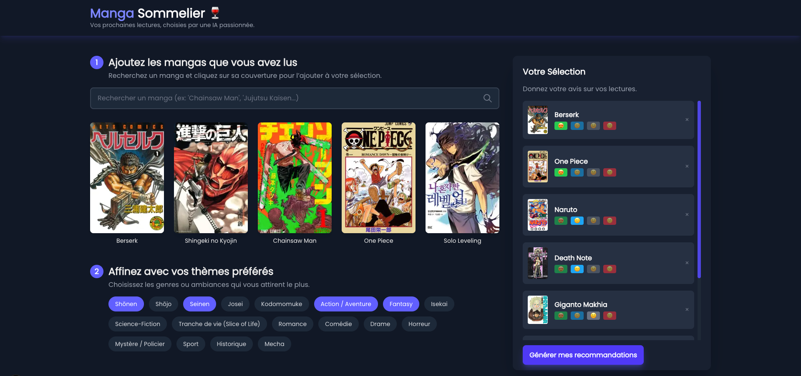
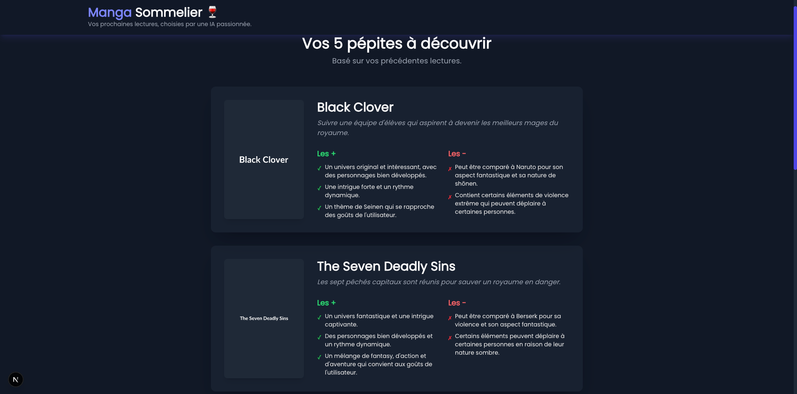

# Manga Sommelier 🍷

Votre prochain coup de cœur manga, déniché par une Intelligence Artificielle qui analyse vos goûts uniques.

[Image de Screenshot de l'application Manga Sommelier]



## Le Concept

Fatigué des recommandations génériques ? **Manga Sommelier** est une application web expérimentale qui vise à offrir des suggestions de lecture ultra-personnalisées.

Contrairement aux algorithmes classiques qui se basent sur "les utilisateurs qui ont aimé X ont aussi aimé Y", notre approche est différente :

1.  Vous nous dites précisément ce que vous avez lu et ce que vous avez **adoré, aimé, ou pas aimé**.
2.  Nous traduisons cette sélection en une instruction nuancée pour un **LLM (Large Language Model)** qui tourne en local.
3.  L'IA analyse vos goûts en profondeur et génère 5 recommandations sur mesure, avec une explication de pourquoi chaque manga pourrait vous plaire.

## ✨ Technologies Utilisées

* **Frontend :** Next.js, React, TypeScript, Tailwind CSS
* **Données Manga :** [Jikan API (pour MyAnimeList)](https://jikan.moe/)
* **Moteur de Recommandation :** [Ollama](https://ollama.com/) avec un modèle customisé (basé sur Mistral).

## ⚠️ Informations Importantes sur le Projet

Ce projet est une expérimentation personnelle, développée sur mon temps libre. Merci de prendre en compte les points suivants :

### Dépendance à Jikan API

Toutes les données concernant les mangas (titres, couvertures, synopsis) proviennent de l'excellente mais non-officielle **Jikan API**. Ce service est **gratuit et public**, ce qui implique des **quotas d'appels limités** pour éviter les abus.

➡️ **Conséquence :** Il est possible que la recherche de mangas soit parfois lente ou temporairement indisponible si le quota est atteint. **Merci pour votre indulgence si le service rencontre des difficultés.**

### Moteur de Recommandation (LLM)

Le cœur de l'application est un LLM qui tourne localement.
La qualité des recommandations est directement liée à la performance du modèle et à la pertinence du "prompt" qui lui est envoyé.

➡️ **Conséquence :** Le modèle utilisé est encore **instable et en cours d'optimisation**. Les suggestions peuvent parfois être surprenantes, imparfaites, ou même un peu à côté de la plaque. C'est tout l'enjeu du projet !

## 🚀 Futur du Projet

Ce projet est en constante évolution. Les prochaines étapes prévues sont :

* Amélioration continue de la logique de "prompt engineering".
* Test avec différents modèles de LLM pour comparer les résultats.
* Mise à disposition d'un environement Docker.

## 💻 Développement Local

Pour lancer le projet sur votre machine :

1.  **Clonez le dépôt :**
    ```bash
    git clone https://github.com/bastienterrier/manga-sommelier
    ```
2.  **Installez les dépendances :**
    ```bash
    cd [NOM_DU_DOSSIER]
    npm install
    ```
3.  **Lancez le serveur de développement :**
    ```bash
    npm run dev
    ```
4.  Assurez-vous d'avoir une instance d'Ollama fonctionnelle qui sert votre modèle customisé.

---

N'hésitez pas à ouvrir une *issue* si vous rencontrez un bug ou si vous avez des suggestions !
